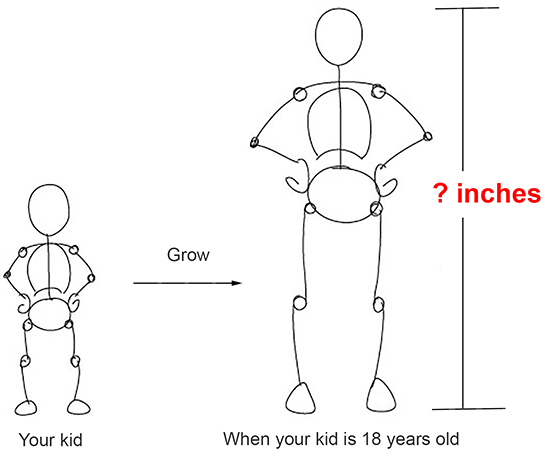
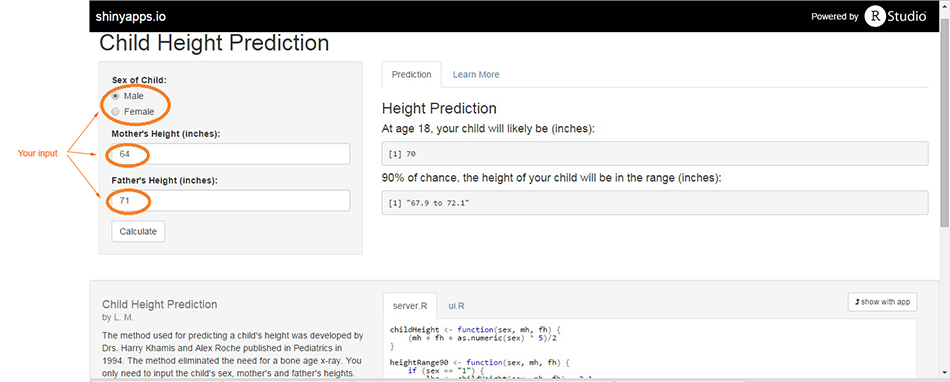

--- 
title       : Child Height Prediction
subtitle    : A Shiny Application
author      : L. M.
job         : 
framework   : io2012        # {io2012, html5slides, shower, dzslides, ...}
highlighter : highlight.js  # {highlight.js, prettify, highlight}
hitheme     : tomorrow      # 
widgets     : []            # {mathjax, quiz, bootstrap}
mode        : selfcontained # {standalone, draft}
knit        : slidify::knit2slides
---

<!-- Center image on slide -->
<script src="http://ajax.aspnetcdn.com/ajax/jQuery/jquery-1.7.min.js"></script>
<script type='text/javascript'>
$(function() {
    $("p:has(img)").addClass('centered');
});
</script>
## What's this Application for?

- This Application is for predicting a child's height at age 18.



--- .class #id 

## Features

> Simple
-  No need for _Growth Chart_, _Bone X rays_, ......
-  Only three parameters needed: Sex of Child, Mother's Height, and Father's Height
  
> Accurate
-  >= 90 percent chance that the real height will be within 2.1 inches of the prediction

---

## Screenshot



- Input 3 parameters, you will get the results your want!

---

## How does it Work?

- Reference

  Predicting Adult Stature Without Using Skeletal Age: The Khamis-Roche Method
  by H.J. Khamis and A.F. Roche, Pediatrics, October 1994  
```{r}
# Function of height
# Mother's height - mh; Father's height - fh; Sex of child - sex (sex = 1 for boys, sex = -1 for girl)
childHeight <- function(sex, mh, fh) {(mh + fh + as.numeric(sex) * 5)/2}
# Example: A boy's height prediction
# mh = 64 inches; fh = 74 inches; sex = 1
print(h <- childHeight(1, 64, 74))
```
Your child's height will likely be `r h` inches at age 18!

  


